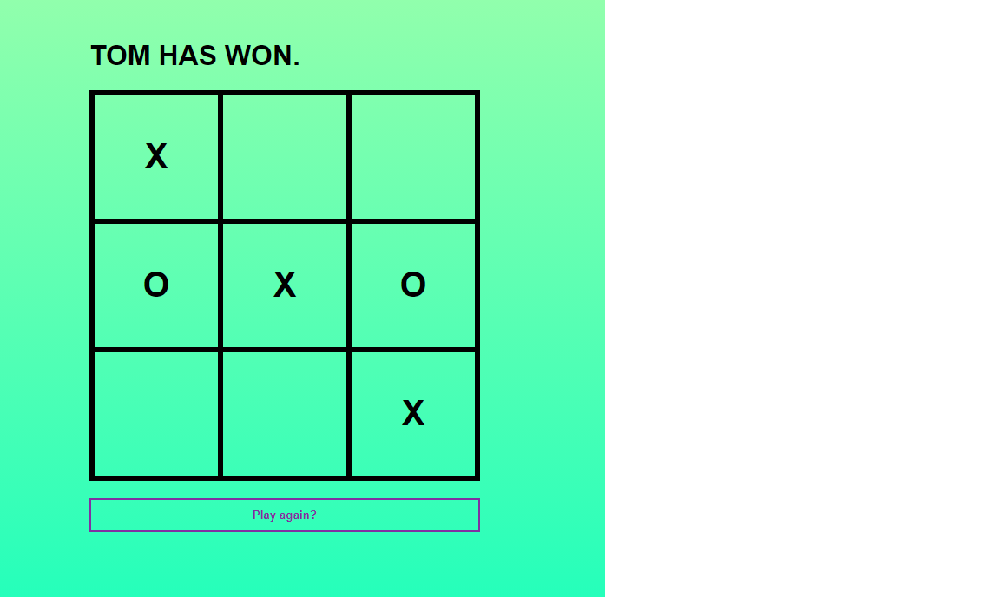

# TIC TAC TOE

> This is a simple Tic Tac Toe game implemented to demonstrate the use of javascript for interactivity and responsiveness in making a functioning game as follows:

1. The game is played on a grid that's 3 squares by 3 squares.
2. Player 1 is X, Player 2 is O. Players take turns putting their marks in empty squares.
3. The first player to get 3 marks in a row (up, down, across, or diagonally) is the winner.
4. When all 9 squares are full without a winner, the game is a draw.

## Built With

- JavaScript
- HTML
- CSS

## [Live demo](https://wintercore.github.io/microverse-tic-tac-toe-js)

## How to run locally

- Install [Node.js](https://nodejs.org/en/download/)
- Clone this repository by running `git clone https://github.com/WinterCore/microverse-tic-tac-toe-js`
- Change your current working directory to the project `cd microverse-tic-tac-toe-js`
- Run `npm install`
- Run `npm start`
- Enjoy

## How to run the tests

- Follow the first 4 steps of the [section above](#how-to-run-locally)
- Run `npm run test`

Note: The tests reside inside of the `tests` folder.

## Authors

👤 Hasan Kharouf

- Github: [@WinterCore](https://github.com/WinterCore)

👤 Paul Omondi

- Github: [@paulo-techie](https://github.com/paulo-techie)

## 🤝 Contributing

Contributions, issues and feature requests are welcome!

Feel free to check the [issues page](issues/).

## Show your support

Give a ⭐️ if you like this project!

## Acknowledgments

- Thanks to Microverse and the wonderful reviewers who have guided us to the completion of this project

## 📝 License

This project is [MIT](lic.url) licensed.
